<h1>About</h1>

- 🔭 I’m currently working/collaborating on [TODOBOT](https://github.com/shitcorp/TODOBOT), [x0](https://github.com/x0tf) and [Iconic-Channels](https://github.com/shitcorp/Iconic-Channels). You can find all my discord related stuff here @[shitcorp](https://github.com/shitcorp/)

- 🌱 Trying to learn Go 
- 👯 I’m looking to collaborate on pretty much anything that involves a REST API
- 🤔 I’m looking for help with [TODOBOT](https://github.com/shitcorp/TODOBOT)
- 💬 Ask me about Infosec, future of programming languages
- 
    

    
📫 How to reach me:

      
      Discord: 686669011601326281 
      
      Email
   
    

- 😄 Pronouns: he/him

 

<h1>Metrics</h1>

  
Click to see my weekly coding stats!
  
  
   
  
  

  

 

  

   

 

# Guestbook

<!--START_SECTION:guestbook-->
 

* **[Pukimaa](https://github.com/Pukimaa) wrote on 4/27/2021:** Heya! I am Pukima also working with MeerBiene on Iconic-Channels and I love the way you do things and also you made some awesome shit ^^

Do you like my project or just want to say hi? Feel free to [post](https://github.com/MeerBiene/MeerBiene/issues/new?title=Guestbook) to my guestbook!
<!--END_SECTION:guestbook-->

<!--

  
  
  
  
  
  
  

-->

 
